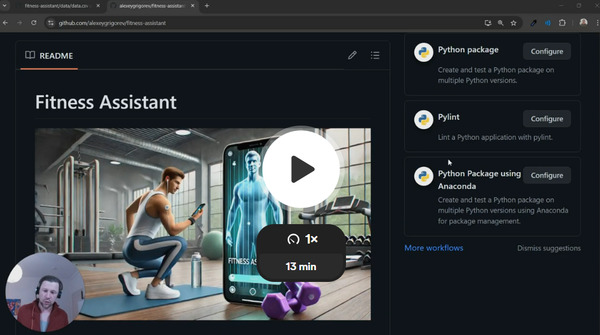
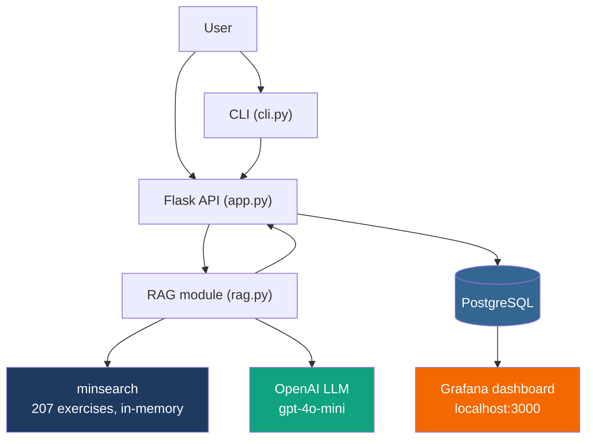
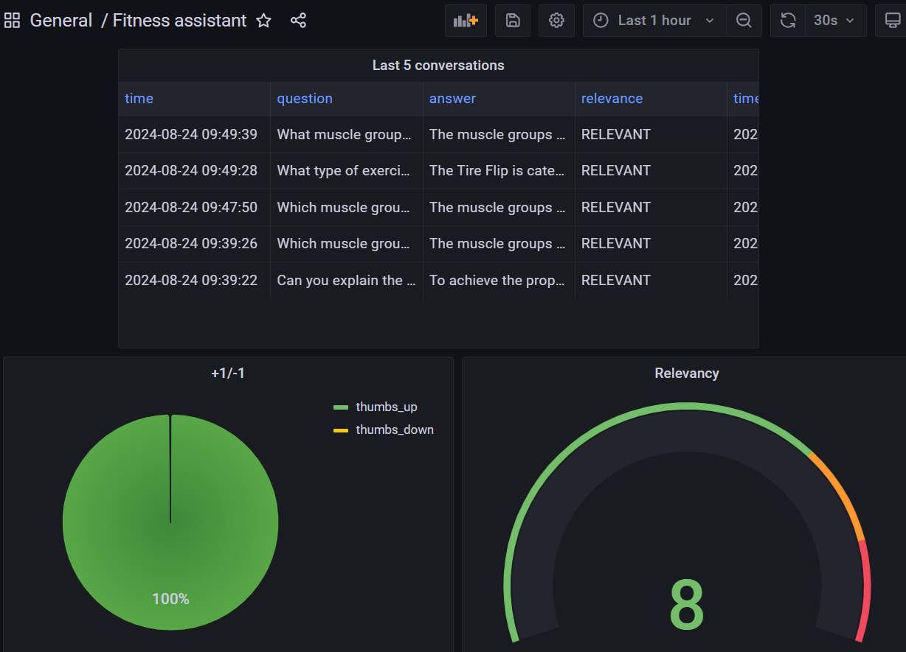

# Fitness Assistant

A conversational AI that helps users choose exercises and find
alternatives, making fitness more approachable for beginners who
find gyms intimidating or can't always access a personal trainer.

Built as a demo project for [LLM Zoomcamp](https://github.com/DataTalksClub/llm-zoomcamp).

<p align="center">
  
</p>

## Demo

<p align="center">
  <a href="https://www.youtube.com/watch?v=RiQcSHzR8_E">
    
  </a>
</p>

Video walkthrough: https://www.youtube.com/watch?v=RiQcSHzR8_E

## Problem

Staying consistent with fitness routines is challenging, especially
for beginners. Gyms can be intimidating, and personal trainers aren't
always available or affordable.

The Fitness Assistant is a RAG application that helps with:

1. Exercise Selection: Recommending exercises based on the type of
activity, targeted muscle groups, or available equipment.
2. Exercise Replacement: Replacing an exercise with suitable
alternatives.
3. Exercise Instructions: Providing guidance on how to perform a
specific exercise.
4. Conversational Interaction: Making it easy to get information
without sifting through manuals or websites.

Target users: beginners who want guidance on exercise selection and
form but don't have access to a personal trainer.

## Quickstart

The easiest way to run the application is with Docker Compose:

```bash
cp .envrc_template .envrc    # add your OPENAI_API_KEY
direnv allow                 # load the key
docker-compose up            # starts the app, postgres, and grafana
```

The app runs at http://localhost:5000, Grafana at http://localhost:3000.

### Prerequisites

- Python 3.12
- Docker and Docker Compose
- OpenAI API key
- [direnv](https://direnv.net/) for environment variables
- [uv](https://docs.astral.sh/uv/) for dependency management

### Full setup

1. Install direnv and allow it:
   ```bash
   sudo apt install direnv
   direnv hook bash >> ~/.bashrc
   ```

2. Copy `.envrc_template` to `.envrc` and add your OpenAI API key:
   ```bash
   cp .envrc_template .envrc
   direnv allow
   ```

3. Install Python dependencies:
   ```bash
   uv sync
   ```

4. Initialize the database:
   ```bash
   docker-compose up postgres
   cd fitness_assistant
   export POSTGRES_HOST=localhost
   uv run python db_prep.py
   ```

5. Run the app:
   ```bash
   docker-compose up
   ```

6. Initialize the Grafana dashboard:
   ```bash
   cd grafana
   uv run python init.py
   ```

### Running locally

If you want to run the app directly on your machine instead of in Docker, start only the Postgres and Grafana containers as dependencies:

```bash
docker-compose up postgres grafana
```

Then run the app on your host machine:

```bash
cd fitness_assistant
export POSTGRES_HOST=localhost
uv run python app.py
```

### Time configuration

When inserting logs into the database, ensure the timestamps are correct.
Otherwise, they won't be displayed accurately in Grafana.

On some systems, specifically WSL, the clock in Docker may get out of sync.
You can check by running:

```bash
docker run ubuntu date
```

If the time doesn't match yours, sync the clock:

```bash
wsl
sudo apt install ntpdate
sudo ntpdate time.windows.com
```

## Testing

There is no automated test suite. The interactive CLI is the primary way to
test the application:

```bash
uv run python cli.py
```

Or pick a random question from the ground truth dataset:

```bash
uv run python cli.py --random
```

You can also test the API with curl:

```bash
URL=http://localhost:5000
QUESTION="Is the Lat Pulldown considered a strength training activity?"
curl -X POST \
    -H "Content-Type: application/json" \
    -d '{"question": "'${QUESTION}'"}' \
    ${URL}/question
```

Example response:

```json
{
    "answer": "Yes, the Lat Pulldown is considered a strength training activity...",
    "conversation_id": "4e1cef04-bfd9-4a2c-9cdd-2771d8f70e4d",
    "question": "Is the Lat Pulldown considered a strength training activity?"
}
```

You can also send feedback:

```bash
curl -X POST \
    -H "Content-Type: application/json" \
    -d '{"conversation_id": "...", "feedback": 1}' \
    ${URL}/feedback
```

## Evaluation

### Retrieval evaluation

Ground truth dataset: 207 exercises with generated questions. The dataset
is in [`data/ground-truth-retrieval.csv`](data/ground-truth-retrieval.csv).

Baseline (minsearch without boosting):
- Hit rate: 94%
- MRR: 82%

Improved (with tuned field boosting):
- Hit rate: 94%
- MRR: 90%

Best boosting parameters:

```python
boost = {
    'exercise_name': 2.11,
    'type_of_activity': 1.46,
    'type_of_equipment': 0.65,
    'body_part': 2.65,
    'type': 1.31,
    'muscle_groups_activated': 2.54,
    'instructions': 0.74
}
```

### RAG flow evaluation

LLM-as-a-Judge over 200 sampled questions. Results for gpt-4o-mini:

- 167 (83%) RELEVANT
- 30 (15%) PARTLY_RELEVANT
- 3 (1.5%) NON_RELEVANT

Also tested gpt-4o:

- 168 (84%) RELEVANT
- 30 (15%) PARTLY_RELEVANT
- 2 (1%) NON_RELEVANT

The difference is minimal, so we opted for gpt-4o-mini for lower cost.

Evaluation notebooks:
- [`rag-test.ipynb`](notebooks/rag-test.ipynb): RAG flow and retrieval evaluation.
- [`evaluation-data-generation.ipynb`](notebooks/evaluation-data-generation.ipynb): Ground truth dataset generation.

Evaluation data:
- [`data/rag-eval-gpt-4o-mini.csv`](data/rag-eval-gpt-4o-mini.csv)
- [`data/rag-eval-gpt-4o.csv`](data/rag-eval-gpt-4o.csv)

## Architecture



## Monitoring

Grafana dashboard at http://localhost:3000 (login: admin / admin).

<p align="center">
  
</p>

The dashboard tracks:
- Last 5 conversations (question, answer, relevance, timestamp)
- User feedback (+1 / -1 pie chart)
- Response relevance (gauge)
- OpenAI cost over time
- Token usage over time
- Model used (bar chart)
- Response time over time

Grafana configurations are in the [`grafana`](grafana/) folder:
- [`init.py`](grafana/init.py) - initializes the datasource and dashboard
- [`dashboard.json`](grafana/dashboard.json) - dashboard configuration

## Decisions and trade-offs

- minsearch over a vector database: the dataset is small (207 records) and
  field-structured, so TF-IDF with tuned boosting works well and avoids the
  overhead of an embedding store. The trade-off is weaker semantic matching
  for paraphrased queries.
- gpt-4o-mini over gpt-4o: evaluation showed near-identical quality (83% vs
  84% RELEVANT), so the cheaper model was chosen.
- In-memory search (no persistent index): the dataset is small enough to index
  at startup. This simplifies deployment but means the app needs to re-ingest
  on every restart.
- Flask over FastAPI: Flask was chosen for simplicity. The trade-off is no
  built-in async support.

## Project structure

```text
fitness_assistant/
  app.py          # Flask API - main entrypoint
  rag.py          # RAG logic: retrieval + prompt building
  ingest.py       # Loads data into the in-memory search index
  minsearch.py    # In-memory TF-IDF search engine
  db.py           # Logs requests and responses to PostgreSQL
  db_prep.py      # Initializes the database schema
data/
  data.csv                       # 207 exercises (generated with ChatGPT)
  ground-truth-retrieval.csv     # Ground truth for retrieval evaluation
  rag-eval-gpt-4o-mini.csv       # RAG evaluation results
  rag-eval-gpt-4o.csv
notebooks/
  rag-test.ipynb                 # RAG flow and retrieval evaluation
  evaluation-data-generation.ipynb
grafana/
  init.py                        # Initializes Grafana datasource and dashboard
  dashboard.json                 # Dashboard configuration
docker-compose.yaml
Dockerfile
Pipfile
```

## Dataset

The dataset contains 207 exercises generated with ChatGPT. Each record includes
exercise name, type of activity, equipment, body part, movement type, muscle
groups, and instructions.

You can find the data in [`data/data.csv`](data/data.csv).

## Limitations

- No automated test suite (only manual CLI and API testing).
- The dataset is small (207 exercises) and generated with ChatGPT, so
  instructions may not be as precise as professionally curated content.
- No web UI - only CLI and API.
- In-memory search means the index is rebuilt on every restart.
- No user authentication or multi-user support.
